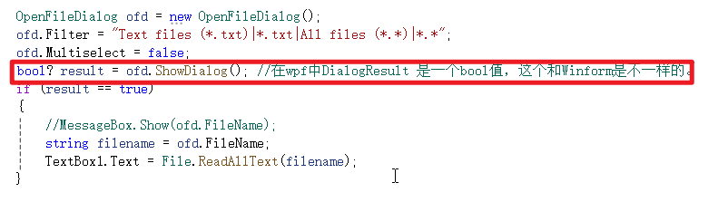
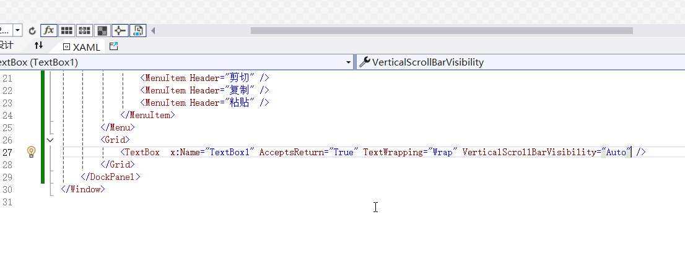
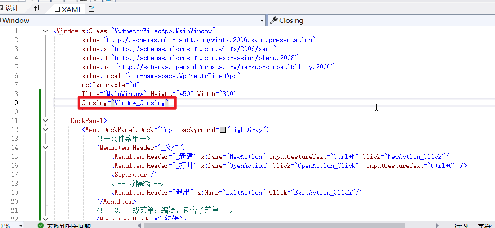
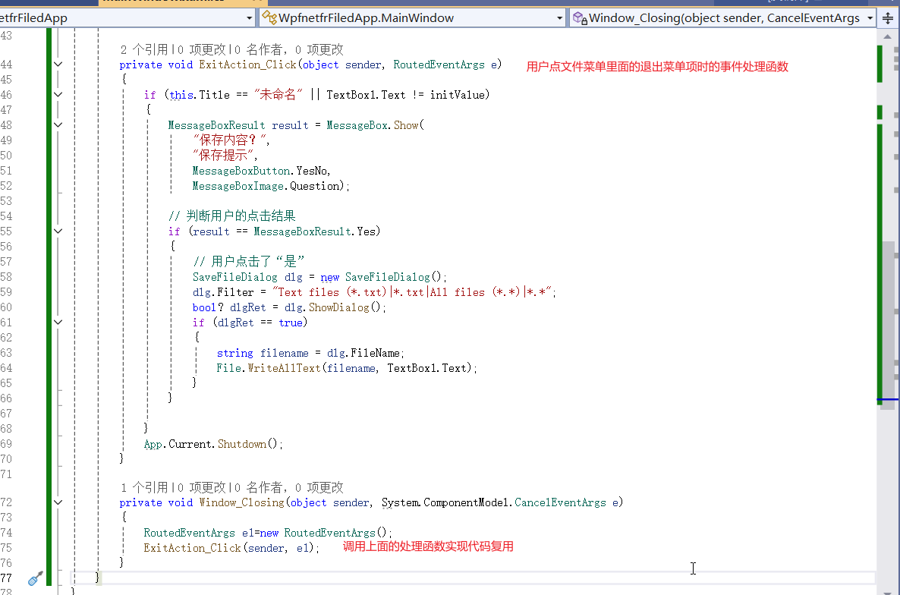

# 用wpf开发需要注意一些问题

## 1.文件对话框的返回值是bool？而不是DialogResult枚举

## 2.读取文本文件的内容，使用 File.ReadAllText(filename);写入文件的内容使用File.WriteAllText(filename, TextBox1.Text);

## 3.设置文本框可以允许多行，在 WPF 中，可以通过设置 `TextBox` 的 `AcceptsReturn` 和 `TextWrapping` 属性，使其支持多行显示与换行输入

## 4.wpf检测用户点击了x，需要给Window添加Closing事件监听，如果你需要在这个事件里面调用一个函数，这个函数不能有Close方法调用，此时应该使用App.Current.Showdown()

## 5.这个Window_Closing函数在调用的时候，窗口真正改变，你可以在这里做一些清理和善后工作比如保存文件，改变数据库连接等等，我们在这里调用 ExitAction_Click函数。注意他的写法

