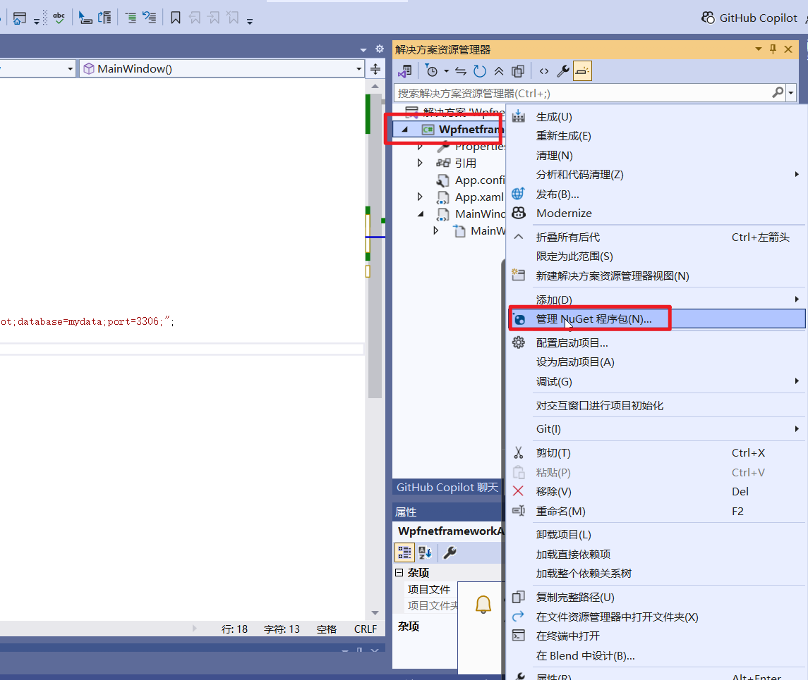
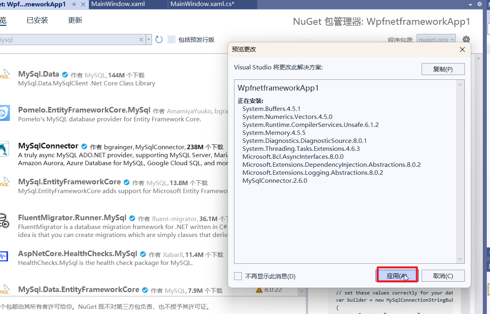
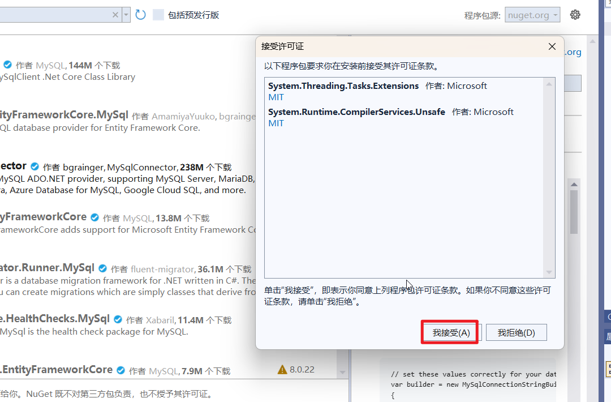
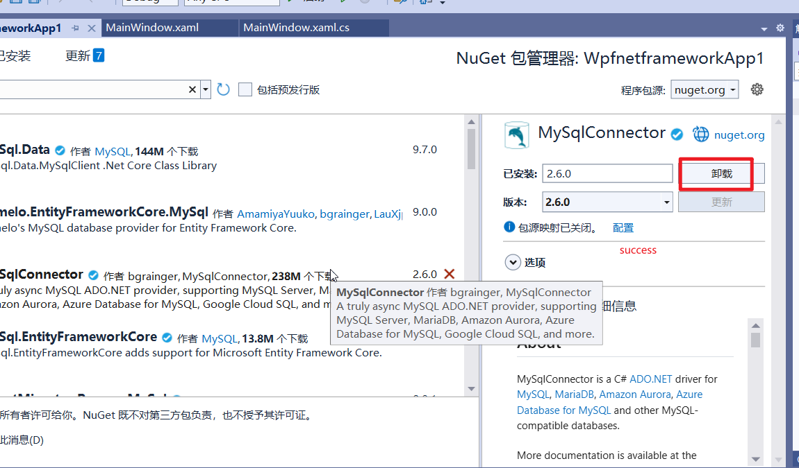
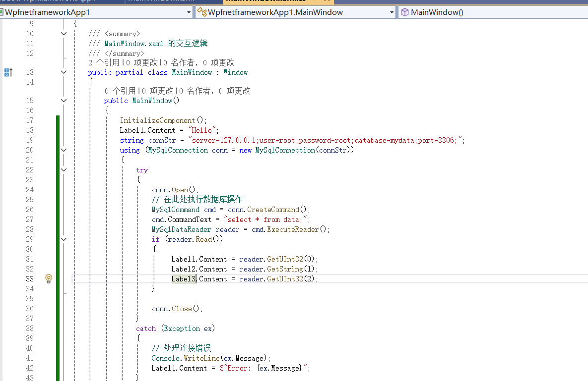
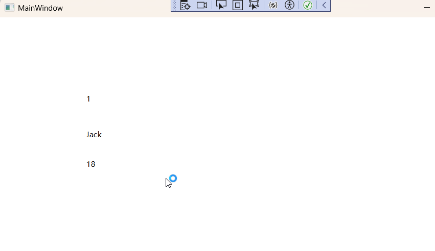

# 1.install the database driver










# 2.use the driver





# 3.上面的操作比较麻烦，如果你需要用MySQL数据库的数据表来填充DataGrid，我们可以使用MySqlDataAdapter类

## 1》在xaml文件在添加一个DataGrid，起名dtGrid，然后我们创建下面的函数,MainWindow.xaml.cs代码如下

```
using MySqlConnector;
using System;
using System.Data;

//using System.Data.SqlClient;
using System.Runtime.InteropServices.ComTypes;
using System.Windows;


namespace WpfnetframeworkApp1
{
    /// <summary>
    /// MainWindow.xaml 的交互逻辑
    /// </summary>
    public partial class MainWindow : Window
    {
        public MainWindow()
        {
            InitializeComponent();
            Label1.Content = "Hello";
            string connStr = "server=127.0.0.1;user=root;password=root;database=mydata;port=3306;";
            using (MySqlConnection conn = new MySqlConnection(connStr))
            {
                try
                {
                    MysqlDemo(conn, this);
                }
                catch (Exception ex)
                {
                    // 处理连接错误
                    Console.WriteLine(ex.Message);
                    Label1.Content = $"Error: {ex.Message}";
                }
                finally
                {
                    conn.Close();
                }
            }

        }

        private static void MysqlDemo2(MySqlConnection conn,MainWindow win)
        {
            conn.Open();
            string sql = "select * from data;";
            MySqlDataAdapter adapter = new MySqlDataAdapter(sql,conn);
            DataTable dt = new DataTable();
            adapter.Fill(dt);
            win.dtGrid.ItemsSource = dt.DefaultView;
            conn.Close();
        }
    }
}

```

## 2》然后我们修改MainWindow.xaml的代码如下

```
<Window x:Class="WpfnetframeworkApp1.MainWindow"
        xmlns="http://schemas.microsoft.com/winfx/2006/xaml/presentation"
        xmlns:x="http://schemas.microsoft.com/winfx/2006/xaml"
        xmlns:d="http://schemas.microsoft.com/expression/blend/2008"
        xmlns:mc="http://schemas.openxmlformats.org/markup-compatibility/2006"
        xmlns:local="clr-namespace:WpfnetframeworkApp1"
        mc:Ignorable="d"
        Title="MainWindow" Height="450" Width="800">
    <Grid>
        <StackPanel>
            <DataGrid x:Name="dtGrid"/>
            <StackPanel Orientation="Horizontal">
                <Label Content="Label" x:Name="Label1"  />
                <Label Content="Label" x:Name="Label2" />
                <Label Content="Label" x:Name="Label3" />
            </StackPanel>
        </StackPanel>
    </Grid>
</Window>

```

## 需要慢慢学习，慢慢修改，看看能否创建一个销售点软件，可能需要较长时间。
