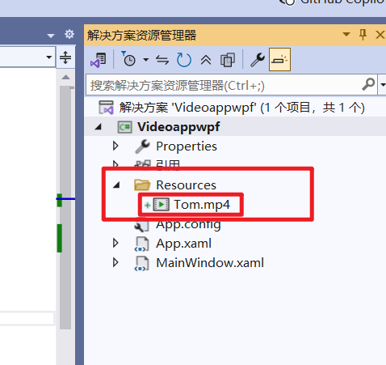
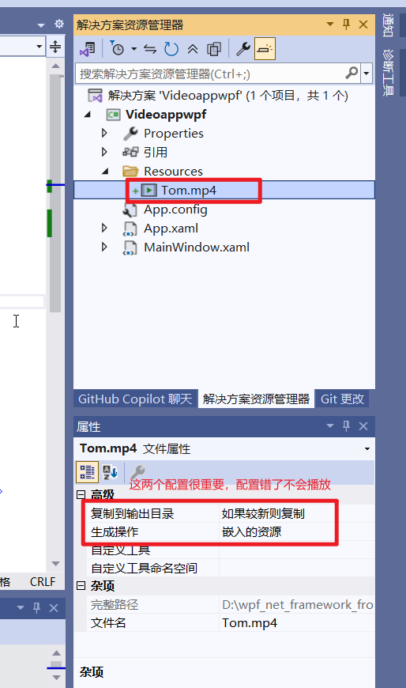
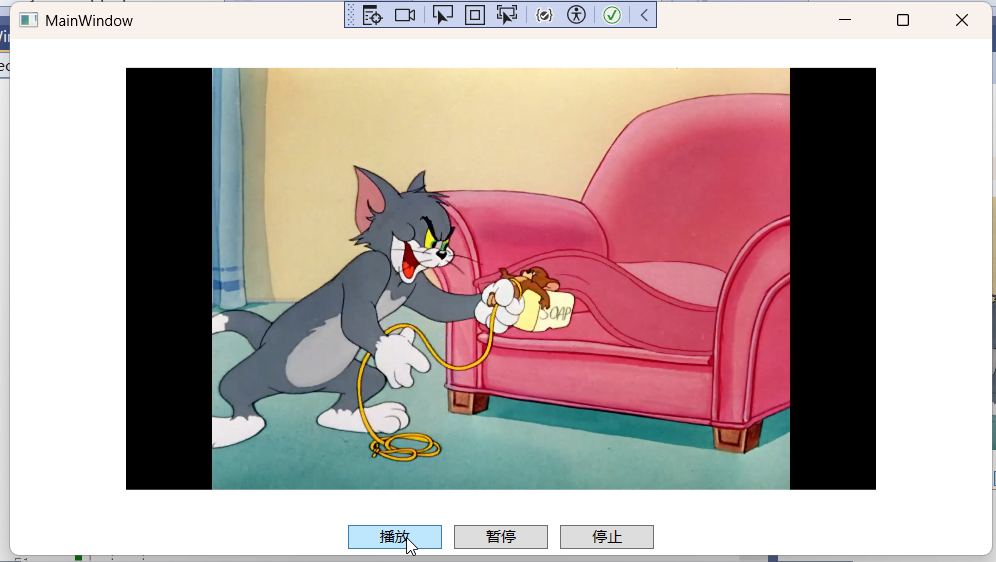

## 1.新建一个wpf应用程序，起名Videoappwpf，然后在给项目添加一个Resources文件夹，然后右击这个文件夹，添加一个视频文件Tom.mp4



## 2.然后，最重要的步骤来了，点击这个视频文件，打开属性面板，在复制到输出目录一栏选择：如果较新则复制，然后在生成一栏选择**<u>嵌入的资源</u>*或者*<u>内容</u>**，<font color='red'>不要选择Resource，会报错</font>，如果你不配置这两个选项，即使你的视频文件的路径是对的，仍然不能够播放视频



 ## 3.视频文件设置正确后其他就相对比较简单，MainWindow.xaml的代码如下

```
<Window x:Class="Videoappwpf.MainWindow"
        xmlns="http://schemas.microsoft.com/winfx/2006/xaml/presentation"
        xmlns:x="http://schemas.microsoft.com/winfx/2006/xaml"
        xmlns:d="http://schemas.microsoft.com/expression/blend/2008"
        xmlns:mc="http://schemas.openxmlformats.org/markup-compatibility/2006"
        xmlns:local="clr-namespace:Videoappwpf"
        mc:Ignorable="d"
        Title="MainWindow" Height="450" Width="800">
    <Grid>
        <Grid.RowDefinitions>
            <RowDefinition Height="*" />
            <RowDefinition Height="Auto" />
        </Grid.RowDefinitions>
        <!-- 视频播放区域 -->
        <MediaElement x:Name="player" 
               Source="Resources/Tom.mp4" 
               LoadedBehavior="Manual" 
               UnloadedBehavior="Close" 
               Width="600"    
               Height="400"  
               MediaOpened="player_MediaOpened"
               MediaFailed="player_MediaFailed"        
               Stretch="Uniform" />

        <!-- 控制面板 -->
        <StackPanel Grid.Row="1" Orientation="Horizontal" HorizontalAlignment="Center">
            <Button Content="播放" x:Name="Play" Click="Play_Click" Width="75" Margin="5"/>
            <Button Content="暂停" x:Name="Pause"  Click="Pause_Click" Width="75" Margin="5"/>
            <Button Content="停止" x:Name="Stop" Click="Stop_Click" Width="75" Margin="5"/>
        </StackPanel>
    </Grid>
</Window>

```

### MainWindow.xaml.cs的代码如下

```
using Microsoft.Win32;
using System;
using System.Collections.Generic;
using System.Linq;
using System.Text;
using System.Threading.Tasks;
using System.Windows;
using System.Windows.Controls;
using System.Windows.Data;
using System.Windows.Documents;
using System.Windows.Input;
using System.Windows.Media;
using System.Windows.Media.Imaging;
using System.Windows.Navigation;
using System.Windows.Shapes;

namespace Videoappwpf
{
    /// <summary>
    /// MainWindow.xaml 的交互逻辑
    /// </summary>
    public partial class MainWindow : Window
    {
        public MainWindow()
        {
            InitializeComponent();
            
        }

        private void Play_Click(object sender, RoutedEventArgs e)
        {
            OpenFileDialog dlg = new OpenFileDialog();

            player.Play();
        }

        private void Pause_Click(object sender, RoutedEventArgs e)
        {
            player?.Pause();
        }

        private void Stop_Click(object sender, RoutedEventArgs e)
        {
            player?.Stop();
        }

        private void player_MediaOpened(object sender, RoutedEventArgs e)
        {
            player?.Play();
        }

        private void player_MediaFailed(object sender, ExceptionRoutedEventArgs e)
        {
            MessageBox.Show("Error Loading Media...");
        }
    }
}

```

### 效果



## 至此一个简单的wpf播放器就可以工作了。以后需要慢慢增加功能